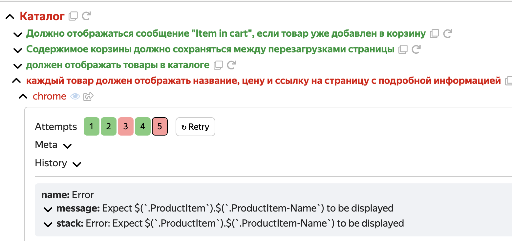
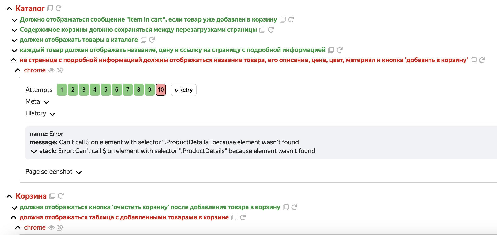
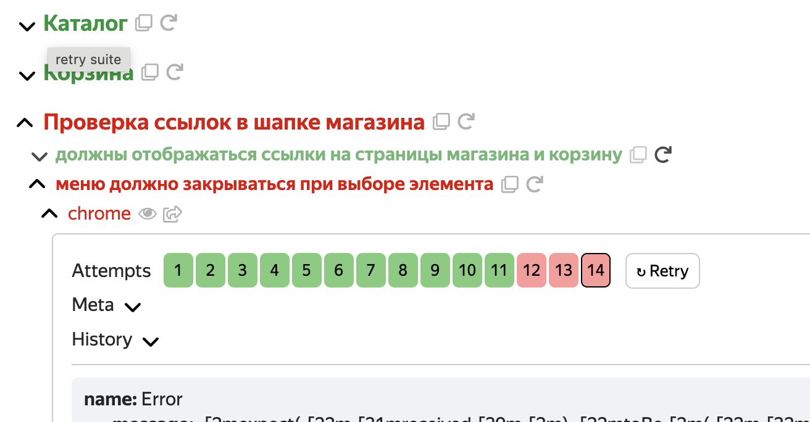
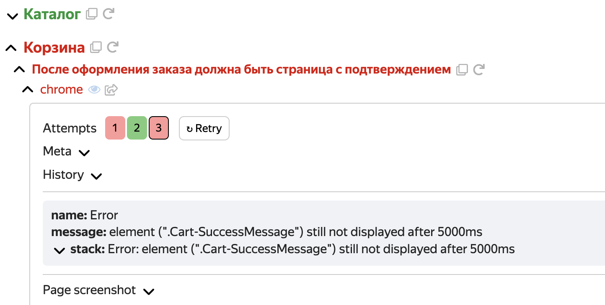
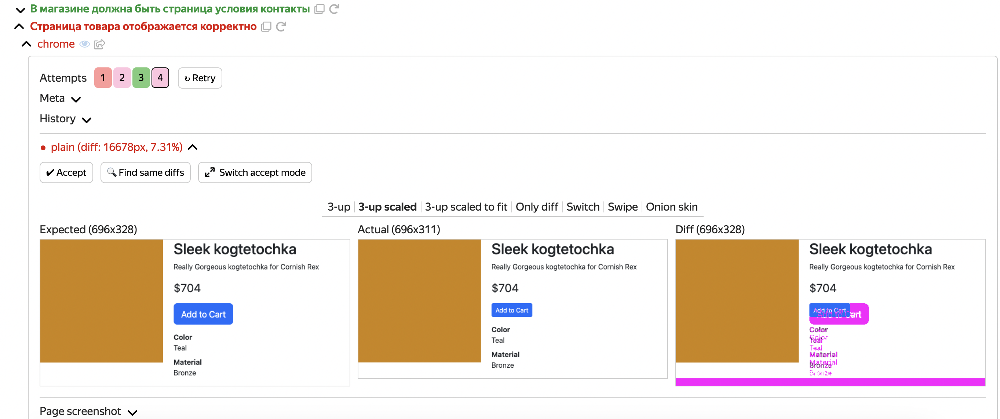
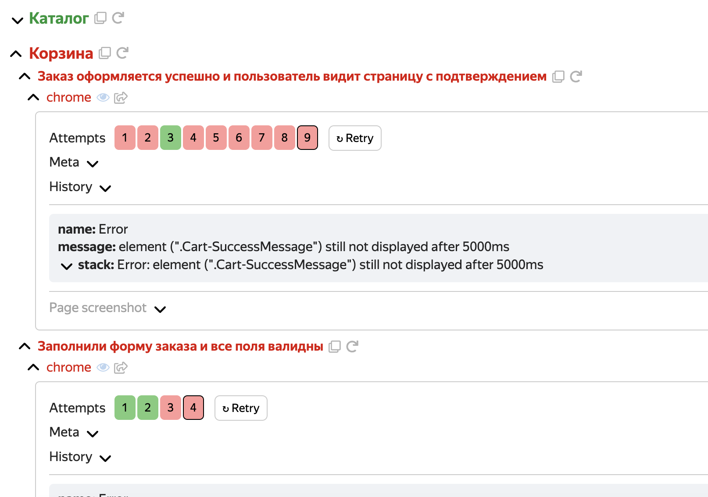

# Домашнее задание ШРИ: Автотесты

Привет! Написаны тесты на Jest и Testplane

## BUG_ID = 1 [Пойман]

Падает один интеграционный тест. Проблемы с отображением имени товара

```
name: Error
message: Expect $(`.ProductItem`).$(`.ProductItem-Name`) to be displayed
Expected: "displayed"
Received: "not displayed"
``` 



## BUG_ID = 2 [Не пойман]

## BUG_ID = 3 [Пойман]

Падает 2 интеграционных теста. В ответе на запрос информации по конкретному товару приходит информация по товару с id = 0, но данные не отображаются.

```
name: Error
message: Can't call $ on element with selector ".ProductDetails" because element wasn't found
```



## BUG_ID = 4 [Пойман]

Падает 1 интеграционный тест. Проблемы с навигационным меню



## BUG_ID = 5 [Пойман]

Падает 1 интеграционный тест. Проблема с оформлением заказа



## BUG_ID = 6 [Не пойман]
## BUG_ID = 7 [Не пойман]
## BUG_ID = 8 [Не пойман]


## BUG_ID = 9 [Пойман]

Падает 1 интеграционный скриншотный тест. Проблема с размерами кнопки заказа




## BUG_ID = 10 [Пойман]

Падает 2 интеграционных теста. Проблема с валидностью полей. 

