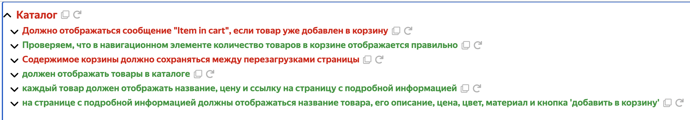
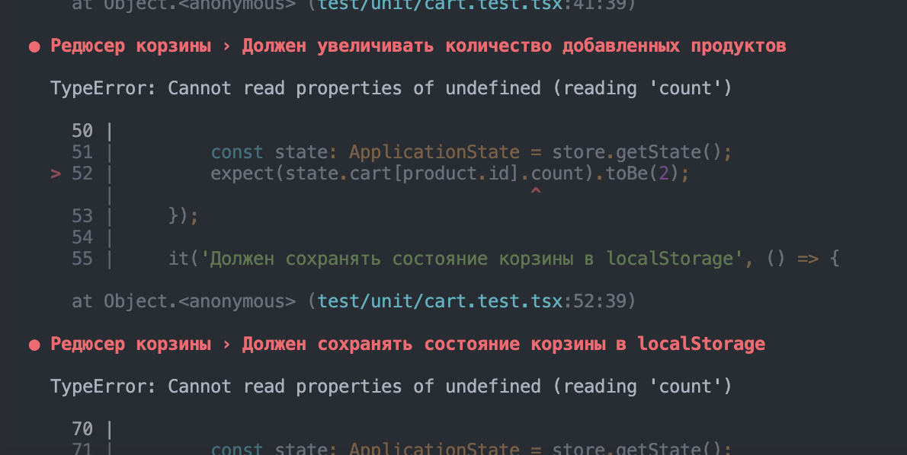
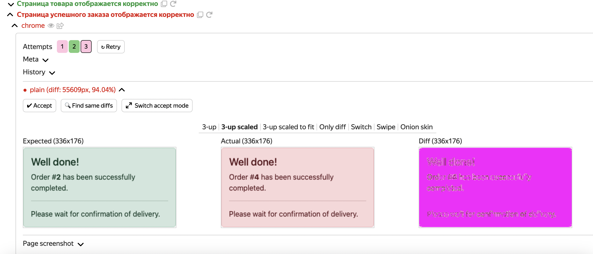

# Домашнее задание ШРИ: Автотесты

Привет! Написаны тесты на Jest и Testplane

- юнит тесты находятся в директории `/test/unit`, 
- интеграционные тесты находятся в директории `/test/testplane`

*Я не знаю, какими будут критерии оценки, поэтому сделал всё на максимум. Пожалуйста, отпишись мне в телеграмм `@shilov_se`, если вдруг увидишь недочёты и нужно будет что-то объяснить. А если вдруг по критериям придётся снизить за что-то балл, прошу тоже отписаться, чтобы я мог запушить минор фиксы. Считаю это честным, ведь критериев чётких у нас не было. С моей стороны будет такая же проверка. Спасибо!*

## BUG_ID = 1 [Пойман]

Падает один интеграционный тест. Проблемы с отображением имени товара

```
name: Error
message: Expect $(`.ProductItem`).$(`.ProductItem-Name`) to be displayed
Expected: "displayed"
Received: "not displayed"
``` 


## BUG_ID = 2 [Не пойман]

Честно, я не посчитал это багом. Возвращается вполне адекватный id заказа. Не считаю, что он обязан во всех случаях в реальной жизни инкрементироваться от 1 до бесконечности.

## BUG_ID = 3 [Пойман]

Падает 2 интеграционных теста. В ответе на запрос информации по конкретному товару приходит информация по товару с id = 0, но данные не отображаются.

```
name: Error
message: Can't call $ on element with selector ".ProductDetails" because element wasn't found
```


## BUG_ID = 4 [Пойман]

Падает 1 интеграционный тест. Проблемы с навигационным меню


## BUG_ID = 5 [Пойман]

Падает 1 интеграционный тест. Проблема с оформлением заказа


## BUG_ID = 6 [Пойман]

Падает несколько интеграционных тестов. Проблема с корзиной. Товары не сохраняются.



## BUG_ID = 7 [Пойман]

Падает 1 юнит тест. Не добавляется товар в корзину.




## BUG_ID = 8 [Пойман]

Падает 1 интеграционный скриншотный тест. Проблема со стилями блока успешного заказа



## BUG_ID = 9 [Пойман]

Падает 1 интеграционный скриншотный тест. Проблема с размерами кнопки заказа


## BUG_ID = 10 [Пойман]

Падает 2 интеграционных теста. Проблема с валидностью полей. 

